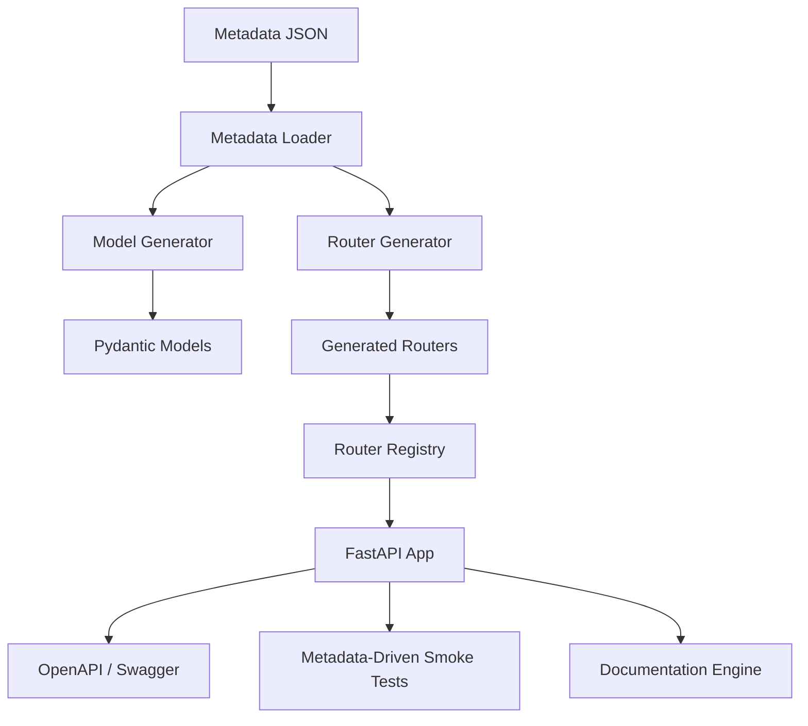
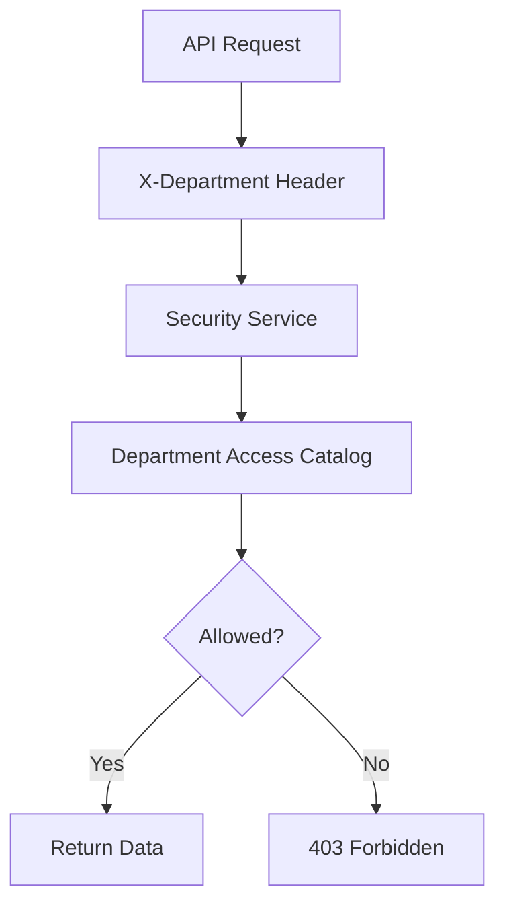
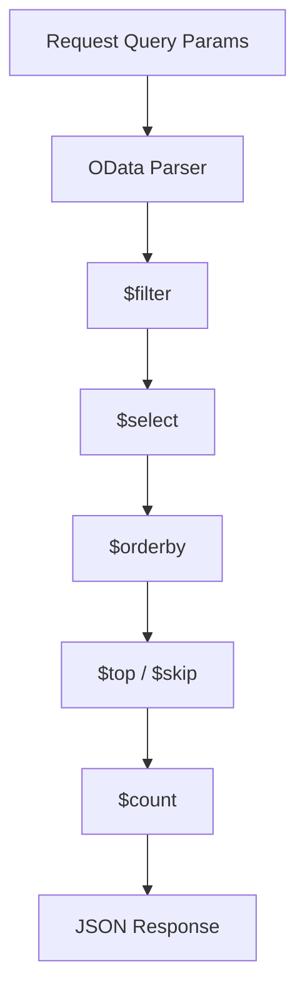

# Global HR Intelligence API

Metadata-driven Enterprise HR API Starter Kit built with FastAPI, OData-style query support, RBAC, generated routers, OpenAPI enrichment, and governed HR metadata.

---

## Project Summary

| Metric | Value |
|---|---:|
| Version | 1.0.0 |
| Generated | 2026-06-26 14:56:09 |
| Entities | 41 |
| Domains | 16 |
| Relationships | 76 |

---

## Features

- FastAPI-based REST API
- Metadata-driven model and router generation
- Auto-discovery of generated routers
- OData-style query options: `$select`, `$filter`, `$orderby`, `$top`, `$skip`, `$count`
- Metadata API endpoints
- Department-based RBAC using `X-Department`
- OpenAPI governance extensions
- Metadata-driven smoke test suite
- Documentation Engine powered by metadata

---

## Architecture

---

## RBAC

---

## OData

---

## Domains

| Domain | Owner Team | Allowed Departments |
| --- | --- | --- |
| Absence Management | Time and Absence | HR Data Governance, HRIS Admin, Time and Absence |
| Benefits | Benefits COE | Benefits COE, HR Data Governance, HRIS Admin |
| Compensation | Compensation COE | Compensation COE, HR Data Governance, HRIS Admin |
| Core HR / Organization | HRIS / Core HR | HR Business Partners, HR Data Governance, HRIS Admin |
| Engagement Surveys | People Analytics | HR Business Partners, HR Data Governance, HRIS Admin, People Analytics |
| Goals | Talent Management | HR Business Partners, HR Data Governance, HRIS Admin, Talent Management |
| Governance & Audit | HR Data Governance | HR Data Governance, HRIS Admin |
| Job Architecture | HRIS / Job Architecture | Compensation COE, HR Data Governance, HRIS Admin |
| Learning | L&D | HR Data Governance, HRIS Admin, L&D |
| Payroll | Payroll Operations | HR Data Governance, HRIS Admin, Payroll Operations |
| Performance Management | Talent Management | HR Business Partners, HR Data Governance, HRIS Admin, Talent Management |
| Personal Development Plans | Talent Management | HR Business Partners, HR Data Governance, HRIS Admin, L&D, Talent Management |
| Recruiting | Talent Acquisition | HR Data Governance, HRIS Admin, Hiring Managers, Talent Acquisition |
| Skills Cloud | L&D / Skills COE | HR Data Governance, HRIS Admin, L&D, Talent Management |
| Succession Planning | Talent Management | Executive HR, HR Data Governance, HRIS Admin, Talent Management |
| Talent Reviews | Talent Management | Executive HR, HR Data Governance, HRIS Admin, Talent Management |

---

## Entities

| Entity | Domain | Owner Team | Primary Key | Dataverse Logical Name |
| --- | --- | --- | --- | --- |
| `absence_plans` | Absence Management | Time and Absence | `absence_plan_id` | ghr_absence_plans |
| `absence_requests` | Absence Management | Time and Absence | `absence_request_id` | ghr_absence_requests |
| `applications` | Recruiting | Talent Acquisition | `application_id` | ghr_applications |
| `benefit_enrollments` | Benefits | Benefits COE | `benefit_enrollment_id` | ghr_benefit_enrollments |
| `benefit_plans` | Benefits | Benefits COE | `benefit_plan_id` | ghr_benefit_plans |
| `business_process_events` | Governance & Audit | HR Data Governance | `business_process_event_id` | ghr_business_process_events |
| `candidates` | Recruiting | Talent Acquisition | `candidate_id` | ghr_candidates |
| `companies` | Core HR / Organization | HRIS / Core HR | `company_id` | ghr_companies |
| `compensation_grades` | Compensation | Compensation COE | `compensation_grade_id` | ghr_compensation_grades |
| `compensation_plans` | Compensation | Compensation COE | `compensation_plan_id` | ghr_compensation_plans |
| `cost_centers` | Core HR / Organization | HRIS / Core HR | `cost_center_id` | ghr_cost_centers |
| `critical_roles` | Succession Planning | Talent Management | `critical_role_id` | ghr_critical_roles |
| `data_quality_issues` | Governance & Audit | HR Data Governance | `dq_issue_id` | ghr_data_quality_issues |
| `goals` | Goals | Talent Management | `goal_id` | ghr_goals |
| `interview_events` | Recruiting | Talent Acquisition | `interview_event_id` | ghr_interview_events |
| `job_families` | Job Architecture | HRIS / Job Architecture | `job_family_id` | ghr_job_families |
| `job_profiles` | Job Architecture | HRIS / Job Architecture | `job_profile_id` | ghr_job_profiles |
| `job_requisitions` | Recruiting | Talent Acquisition | `job_requisition_id` | ghr_job_requisitions |
| `learning_courses` | Learning | L&D | `learning_course_id` | ghr_learning_courses |
| `learning_enrollments` | Learning | L&D | `learning_enrollment_id` | ghr_learning_enrollments |
| `lineage_report` | Governance & Audit | HR Data Governance | `lineage_id` | ghr_lineage_report |
| `locations` | Core HR / Organization | HRIS / Core HR | `location_id` | ghr_locations |
| `offers` | Recruiting | Talent Acquisition | `offer_id` | ghr_offers |
| `pay_groups` | Payroll | Payroll Operations | `pay_group_id` | ghr_pay_groups |
| `payroll_results` | Payroll | Payroll Operations | `payroll_result_id` | ghr_payroll_results |
| `payslip_lines` | Payroll | Payroll Operations | `payslip_line_id` | ghr_payslip_lines |
| `performance_reviews` | Performance Management | Talent Management | `performance_review_id` | ghr_performance_reviews |
| `personal_development_plans` | Personal Development Plans | Talent Management | `pdp_id` | ghr_personal_development_plans |
| `positions` | Core HR / Organization | HRIS / Core HR | `position_id` | ghr_positions |
| `skill_assessments` | Skills Cloud | L&D / Skills COE | `assessment_id` | ghr_skill_assessments |
| `skills` | Skills Cloud | L&D / Skills COE | `skill_id` | ghr_skills |
| `succession_candidates` | Succession Planning | Talent Management | `succession_candidate_id` | ghr_succession_candidates |
| `succession_pools` | Succession Planning | Talent Management | `pool_id` | ghr_succession_pools |
| `supervisory_organizations` | Core HR / Organization | HRIS / Core HR | `supervisory_org_id` | ghr_supervisory_organizations |
| `survey_responses` | Engagement Surveys | People Analytics | `response_id` | ghr_survey_responses |
| `surveys` | Engagement Surveys | People Analytics | `survey_id` | ghr_surveys |
| `talent_reviews` | Talent Reviews | Talent Management | `talent_review_id` | ghr_talent_reviews |
| `validation_report` | Governance & Audit | HR Data Governance | `validation_id` | ghr_validation_report |
| `worker_compensation` | Compensation | Compensation COE | `worker_compensation_id` | ghr_worker_compensation |
| `worker_skills` | Skills Cloud | L&D / Skills COE | `worker_skill_id` | ghr_worker_skills |
| `workers` | Core HR / Organization | HRIS / Core HR | `worker_id` | ghr_workers |

---

## Roadmap

### v1.0 Core

- Metadata-driven FastAPI framework
- Generated Pydantic models and routers
- OData-style query support
- Department-based RBAC
- Metadata API
- OpenAPI governance enrichment
- Metadata-driven smoke test suite
- Documentation Engine

### v1.5 Enterprise Foundation

- pytest integration
- coverage reports
- GitHub Actions CI/CD
- Dockerfile and docker-compose
- PostgreSQL / SQL Server / Dataverse data providers
- Metadata schema validation

### v2.0 Enterprise Edition

- JWT / OAuth2 / Microsoft Entra ID
- SDK generation for Python, C#, and TypeScript
- `$expand` support
- AI-assisted metadata catalog
- Enterprise documentation portal
